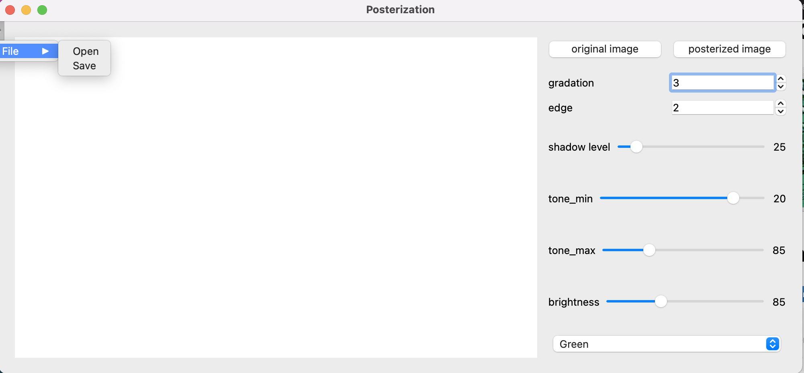

# Posterization


## Environment


```
pyside6
opencv-python
pillow
```

## Demo

1. Run
```
python main_gui.py
```

2. Open a source file from `Sidebar -> File -> Open`



3. Get a posterized image

   - Obtain various posterized images by changing the hyperparameters
   - Switch images by `original image` and `posterized image` buttons

4. Save the posterized image from `Sidebar -> File -> Save`

## Note

- https://docs.opencv.org/4.x/d3/d50/group__imgproc__colormap.html